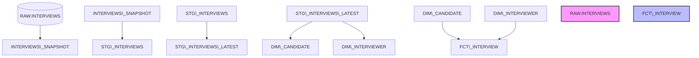

DBT Snowflake Analytics Project
📋 Overview
This project demonstrates the implementation of a modern analytics engineering workflow using dbt and Snowflake.
The architecture encompasses data ingestion, historical tracking, rigorous testing, and dimensional modeling to transform raw, messy data into production-ready analytical tables.
The project includes:
Source configuration & freshness tracking
Snapshots for Type 2 Slowly Changing Dimensions (SCD Type 2)
Staging layer with cleaning and incremental loading
Dimensional modeling (Star Schema with Dimension and Fact tables)
Data quality testing (Built-in, Custom, and Community Packages)
Git version control for robust workflow management
---
🏗️ Project Architecture

---
💾 Layer Specifications
1. Source Layer
Configured and tracked sources inside Snowflake:
`RAW.JAFFLE\_SHOP.CUSTOMERS`
`RAW.JAFFLE\_SHOP.ORDERS`
`RAW.STRIPE.PAYMENT`
`DBT\_PROJECT.RAW.INTERVIEWS`
Source-Level Safeguards:
⏱️ `freshness` anomalies tracking
🔏 `not\_null` and `unique` constraints
2. Snapshot Layer (`interviews\_snapshot`)
Captures historical changes over time using Snowflake structures.
Strategy: `check`
Check Columns: `all`
Hard Deletes: `new\_record`
Unique Key: `\_OFFSET` (Chosen after resolving duplicate issues found on the raw interview ID)
3. Staging Layer
`stg\_interviews`: Performs data cleaning, parsing, and column standardization.
`stg\_interviews\_latest`: Incremental model containing only the most recent interview records.
`stg\_orders`: Base order staging model.
`stg\_orders\_latest`: Incremental model optimized for fresh order state calculations.
4. Marts / Dimensional Models
`dim\_candidate`: Candidate dimension containing unique records. (8,374 rows)
`dim\_interviewer`: Interviewer dimension containing operational details. (1,818 rows)
`fct\_interview`: Central fact table combining interview activities, timestamps, and foreign keys linking candidates and interviewers. (18,248 rows)
---
🛡️ Data Quality Testing Framework
The pipeline implements a multi-layered testing layout to catch data anomalies early in the development loop.
Standard Framework Tests: `unique`, `not\_null`, `relationships`, `accepted\_values`
Community Packages: `dbt\_utils` generic tests for business logic verification
Custom Data Tests:
`fct\_interview\_candidate\_exists`
`fct\_interview\_interviewer\_exists`
`fct\_interview\_status\_valid`
🔍 Identified Data Quality Issues
During execution, the test suite caught several structural issues prepared in the source data:
Missing interviewer identifiers (`null` values where corporate logic requires them)
Broken interviewer references (orphan keys in staging)
Referential integrity violations (mismatches between fact and dimension grains)
---
🚀 Deployment Summary
Row Counts Matrix
Target Object	Strategy / Layer	Row Count
`INTERVIEWS\_SNAPSHOT`	Snapshot (SCD Type 2)	100,261
`STG\_INTERVIEWS\_LATEST`	Incremental Staging	8,374
`DIM\_CANDIDATE`	Dimension	8,374
`DIM\_INTERVIEWER`	Dimension	1,818
`FCT\_INTERVIEW`	Fact Table	18,248
---
🛠️ Technologies Used
dbt (Data Build Tool) - Transformation & Testing
Snowflake - Cloud Data Platform Warehouse
dbt_utils - Extended Macro Package
Git & GitHub - Collaboration, Review & CI/CD Pipeline
